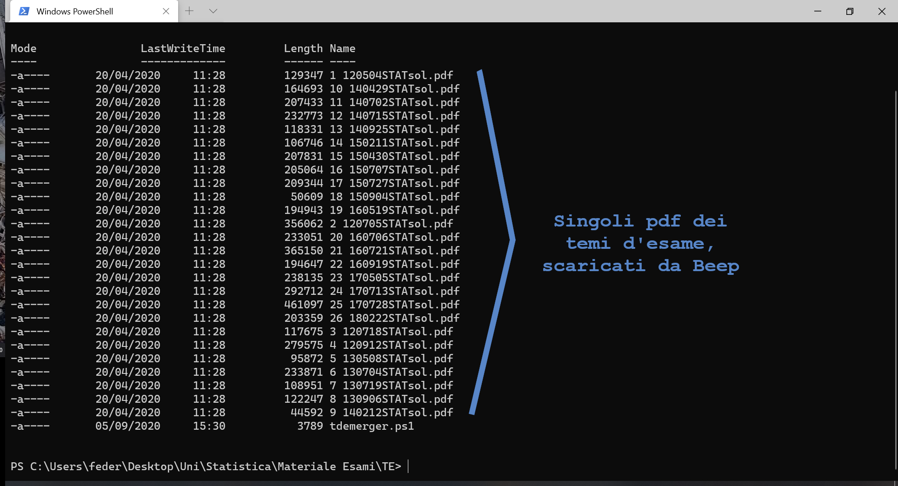
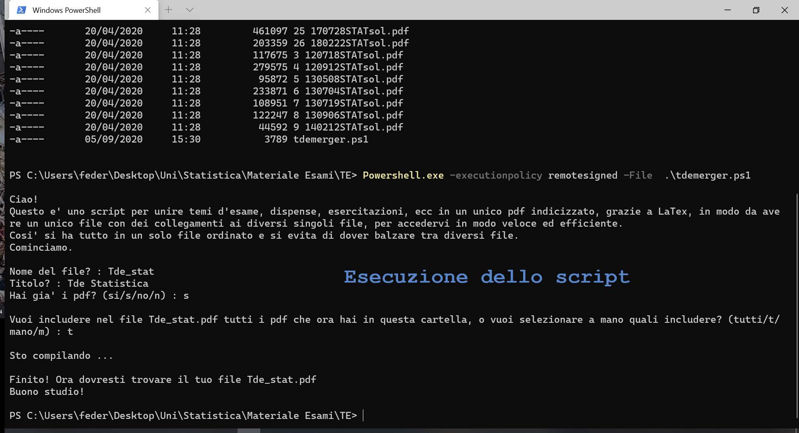

# Descrizione

Script che unisce temi d'esame/dispense/esercitazioni in un unico pdf indicizzato.

Cioè lo script crea un unico pdf che, grazie a LaTex, è diviso in capitoli (con dei collegamenti cliccabili) che corrispondono ai singoli pdf iniziali.
Cosi' si ha tutto in un solo file ordinato e si evita di dover balzare tra troppi file diversi.
I pdf possono essere già presenti nella cartella in cui si lacia lo script, altrimenti si può anche fornire il link del sito in cui si trovano e lo script proverà a scaricarli da solo.

Una volta lanciato, lo script vi chiederà:
1. nome del file
2. titolo del file
3. se i pdf sono già nella cartella corrente o se volete scaricarli da internet; nel secondo caso vi chiedera un url, il link del sito in cui si trovano
4. se vuoi includere tutti i pdf o selezionare "a mano" quali includere e quali no

### Requisiti

Aver installato pdflatex (cioè aver installato TexStudio o un programma simile sul vostro pc).

### Consigli per Powershell

Provate a schiacciare Tab mentre digitate, vi autocompleterà le parole. E per copiare/incollare cose serve Ctrl+Shift+C/V.

### Istruzioni

1. Scaricare il file *tdemerger.ps1* e metterlo nella cartella in cui si trovano i pdf da unire.

2. Aprire Windows PowerShell cercando Powershell nel menù di Windows, o Windows Terminal (sempre cercando il nome dal menù di Windows).

3. Spostarsi nella cartella in cui si vogliono unire i pdf, con il comando:
```
cd Percorso\verso\la\cartella
```
Altrimenti selezionare la cartella in cui si vuole lanciare lo script, poi cliccarci sopra col tasto destro, e infine selezionare l'opzione che permette di aprirla in Windows PowerShell o Windows Terminal.

4. Lanciare il comando:
```
Powershell.exe -executionpolicy remotesigned -File  .\tdemerger.ps1
```
per eseguire lo script.

###  Risultato




