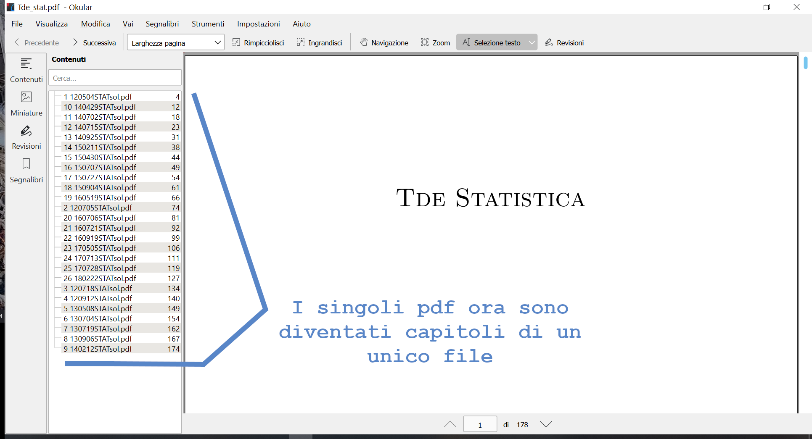

# tdemerger

Script that merges exams/lecture notes/exercises in a single and indexed pdf, which means that is divided into chapters.

That is, the script creates a single pdf which, thanks to LaTex, is divided into chapters (with clickable links) which correspond to the individual initial pdfs.
So you have everything in one sorted file and avoid having to jump between too many different files.
The pdfs may already be present in the folder where you leave the script, otherwise you can also provide the link of the site where they are located and the script will try to download them by itself.

Once launched, the script will ask you:
1. file name (don't use acccents)
2. file title (don't use acccents)
3. if the pdfs are already in the current folder or if you want to download them from the internet; in the second case it will ask you for a url, the link of the site where they are located
4. if you want to include all pdfs or select "by hand" which ones to include and which not

### Requirements

Have installed pdflatex (i.e. have installed TexStudio or a similar software on your pc).

### Instructions

1. Download the file *tdemerger_en.ps1* and put it in the folder where there are the pdfs to be merged.

2. Open Windows PowerShell by searching Powershell in the Windows menu, or the Windows Terminal (also looking for it from the Windows menu).

3. Move to the folder where you want to merge the pdf, with the command:
```
cd Path\to\the\folder
```
Otherwise, select the folder in which you want to launch the script, then right-click it, and finally select the option that allows you to open it in Windows PowerShell or Windows Terminal.

4. Run the command:
```
Powershell.exe -executionpolicy remotesigned -File .\tdemerger.ps1
```
to run the script. Or
```
Powershell.exe -executionpolicy remotesigned -File C:\path\to\the\file\tdemerger.ps1
```
if it's not in the same folder of the tdes.

### Result


Text: various pdfs of exams, downloaded from Beep.

Text: exectution of the script.

Text: each pdf file has now become a chapter of a unique pdf.
